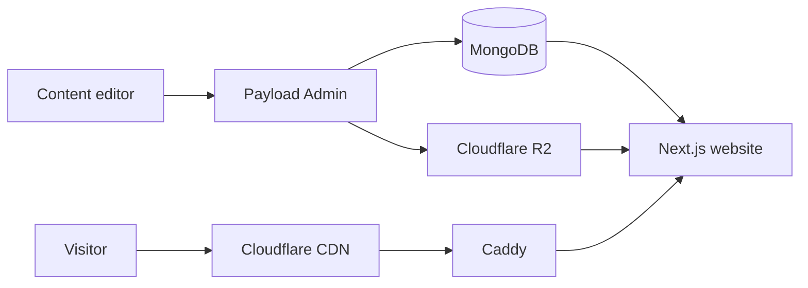

# Ecolitea README Implementation Plan

> **For agentic workers:** REQUIRED SUB-SKILL: Use superpowers:subagent-driven-development (recommended) or superpowers:executing-plans to implement this plan task-by-task. Steps use checkbox (`- [ ]`) syntax for tracking.

**Goal:** Replace the inherited Payload Website README with an English, CMS-first Ecolitea README that documents active capabilities, local configuration, and the target GHCR/Docker Compose/Caddy/Cloudflare deployment architecture.

**Architecture:** Rewrite only `README.md`. The document separates product capabilities, local operation, environment configuration, production topology, and routine operations. It is the written contract for subsequent Dockerfile, Docker Compose, production Caddy, and GHCR workflow work; those assets are not created in this task.

**Tech Stack:** Markdown, GitHub-flavored Markdown, Mermaid, Payload 3.72.0, Next.js 15, pnpm 9.15.4, MongoDB, Cloudflare R2, Cloudflare CDN, Caddy, Docker Compose, GHCR.

---

## File Structure

- Modify: `README.md` — complete public-facing product, setup, configuration, deployment, and operations reference.
- Create: `docs/superpowers/specs/2026-08-06-ecolitea-readme-design.md` — approved design specification; already present.
- Create: `docs/superpowers/plans/2026-08-06-ecolitea-readme.md` — this implementation plan.

### Task 1: Establish the README content contract

**Files:**
- Test: one-off Node.js assertion against `README.md`

- [ ] **Step 1: Run the failing content-contract assertion**

Run:

```bash
node -e "const fs=require('fs');const text=fs.readFileSync('README.md','utf8');const required=['# Ecolitea CMS','## Core Capabilities','## Production Architecture','## Local Development','## Environment Configuration','## Production Deployment','## Operations'];const forbidden=['# Payload Website','## ☁️ Payload Cloud','### Documentation','### Hosts file'];const missing=required.filter((item)=>!text.includes(item));const present=forbidden.filter((item)=>text.includes(item));if(missing.length||present.length){console.error(JSON.stringify({missing,present}));process.exit(1)}"
```

Expected: exit code `1`, because the inherited README is still Payload Website documentation and does not contain the Ecolitea section set.

- [ ] **Step 2: Record the verified content requirements**

The rewritten README must include these exact top-level headings:

```markdown
# Ecolitea CMS
## Core Capabilities
## Production Architecture
## Local Development
## Environment Configuration
## Production Deployment
## Operations
## Troubleshooting
```

It must not contain inherited official-website content about Payload Cloud, official documentation synchronization, GitHub OAuth, or hosts-file configuration.

### Task 2: Replace the README with the CMS-first reference

**Files:**
- Modify: `README.md`

- [ ] **Step 1: Replace the inherited introduction and technology-first copy**

Write an English opening that identifies Ecolitea as a CMS-driven website built on a Payload customization. State that the Payload Admin panel is the primary editorial interface and that the website renders managed content. Do not use Payload official-product marketing language.

- [ ] **Step 2: Add the Core Capabilities section**

Document active capability groups with concise descriptions:

```markdown
- Content management: pages, posts, categories, case studies, reusable content, and flexible blocks.
- Media management: uploads, image sizes, and Cloudflare R2-backed public media delivery.
- Site configuration: main navigation, footer, top bar, and conversion settings.
- Growth operations: forms, email notifications, SEO, redirects, analytics, and operational counters.
- Administration: administrator users and content-management access control.
```

Do not list disabled Cloud, documentation, community-help, partner, or styleguide modules.

- [ ] **Step 3: Add the target architecture diagram and explanation**

Add a GitHub-compatible Mermaid diagram that includes the following relationships:



Explain that public release images are distributed through GHCR and that the production application runs in Docker Compose alongside MongoDB.

- [ ] **Step 4: Add local development instructions using existing project commands**

Document these commands exactly:

```bash
corepack pnpm@9.15.4 install --frozen-lockfile
corepack pnpm@9.15.4 payload migrate
corepack pnpm@9.15.4 dev
corepack pnpm@9.15.4 exec tsc --noEmit --incremental false
corepack pnpm@9.15.4 build:skipDocs
```

Explain the prerequisites: Node.js, Corepack, pnpm 9.15.4, a running MongoDB service, and an `.env` file copied from an environment template rather than committed credentials.

- [ ] **Step 5: Add environment-variable documentation without secret values**

Create Markdown tables for:

```markdown
| Group | Variables |
| --- | --- |
| Core application | PAYLOAD_SECRET, NEXT_PUBLIC_SITE_URL, PAYLOAD_PUBLIC_APP_URL |
| Database | DATABASE_URI |
| Media storage | R2_BUCKET, R2_ACCESS_KEY_ID, R2_SECRET_ACCESS_KEY, R2_ENDPOINT, R2_PUBLIC_URL |
| Email and integrations | SENDGRID_API_KEY, analytics and optional service variables |
```

Use placeholders such as `YOUR_DOMAIN`, `YOUR_R2_BUCKET`, and `mongodb://HOST:27017/ecolitea`. State that `PAYLOAD_SECRET` must be at least 32 random characters and that R2 access keys must never be committed.

- [ ] **Step 6: Add the target production deployment reference**

Document the target model, not files that do not yet exist:

```markdown
Cloudflare CDN -> Caddy -> Docker Compose -> Ecolitea application + MongoDB
GHCR -> Docker Compose image pull
Cloudflare R2 -> public media storage
```

Use these placeholders in every example: `YOUR_DOMAIN`, `GHCR_OWNER`, `YOUR_IMAGE_TAG`, and `YOUR_SERVER_IP`. Explain Cloudflare Full (strict) TLS, Caddy as the origin reverse proxy, MongoDB persistent volumes, R2's independence from container storage, immutable image tags, upgrade, rollback, and backups.

- [ ] **Step 7: Add operations and troubleshooting sections**

Include the purpose of migrations, type checks, production builds, container status/log review, MongoDB backups, R2 credential verification, and rollback by image tag. Add configuration symptoms and corrective actions without showing actual credentials.

### Task 3: Verify the README

**Files:**
- Test: one-off Node.js content-contract assertion against `README.md`
- Test: one-off Node.js secret-pattern assertion against `README.md`

- [ ] **Step 1: Run the content-contract assertion**

Run:

```bash
node -e "const fs=require('fs');const text=fs.readFileSync('README.md','utf8');const required=['# Ecolitea CMS','## Core Capabilities','## Production Architecture','## Local Development','## Environment Configuration','## Production Deployment','## Operations','## Troubleshooting','```mermaid'];const forbidden=['# Payload Website','## ☁️ Payload Cloud','### Documentation','### Hosts file','ghp_'];const missing=required.filter((item)=>!text.includes(item));const present=forbidden.filter((item)=>text.includes(item));if(missing.length||present.length){console.error(JSON.stringify({missing,present}));process.exit(1)}console.log('README content contract passed')"
```

Expected: exit code `0` and `README content contract passed`.

- [ ] **Step 2: Run the secret-pattern assertion**

Run:

```bash
node -e "const fs=require('fs');const text=fs.readFileSync('README.md','utf8');const patterns=[/R2_SECRET_ACCESS_KEY=[A-Za-z0-9]{20,}/,/PAYLOAD_SECRET=[A-Za-z0-9]{32,}/,/mongodb:\/\/127\.0\.0\.1:27017\/ecolitea/];const matches=patterns.filter((pattern)=>pattern.test(text)).map(String);if(matches.length){console.error(matches);process.exit(1)}console.log('README contains no concrete credentials or local database endpoint')"
```

Expected: exit code `0` and `README contains no concrete credentials or local database endpoint`.

- [ ] **Step 3: Verify documented local commands against the project**

Run:

```bash
corepack pnpm@9.15.4 exec tsc --noEmit --incremental false
corepack pnpm@9.15.4 build:skipDocs
```

Expected: both commands exit with code `0`.

- [ ] **Step 4: Review the rendered Markdown source**

Run:

```bash
sed -n '1,360p' README.md
```

Confirm headings are ordered, tables render as Markdown, Mermaid fences open and close, and no real environment values appear.

## Version Control

No commit step is included. The workspace is not a Git repository, and the user explicitly requested that no Git repository be created.
